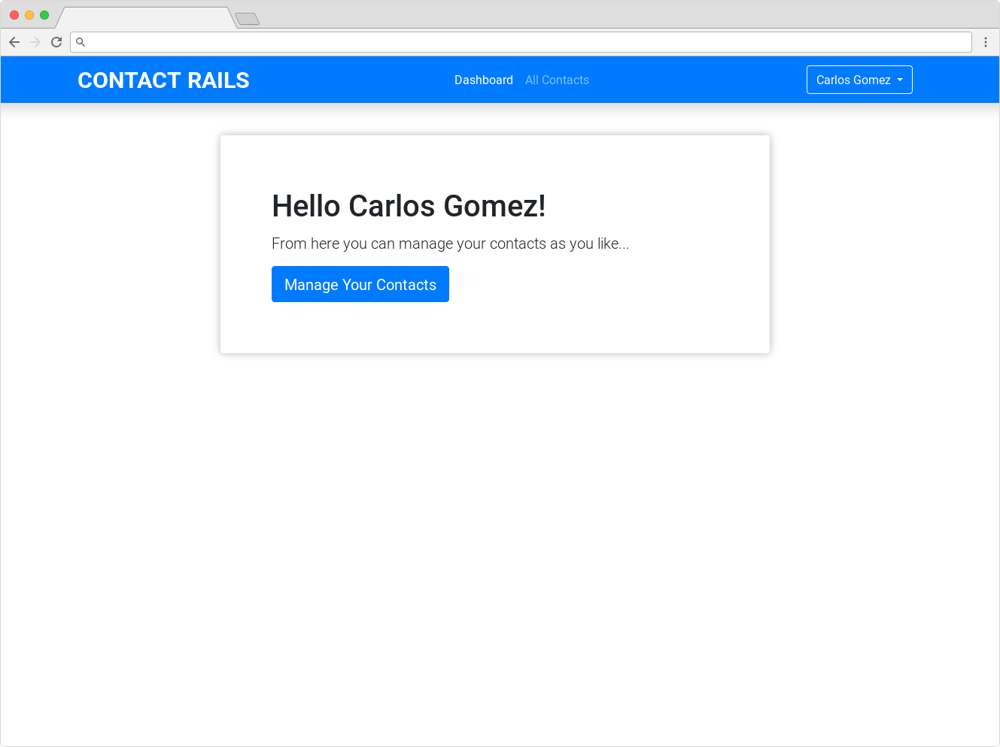
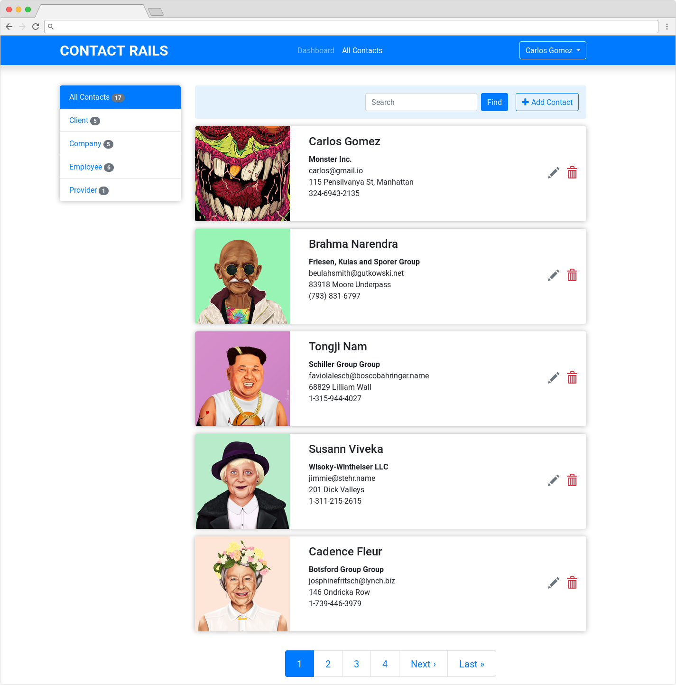
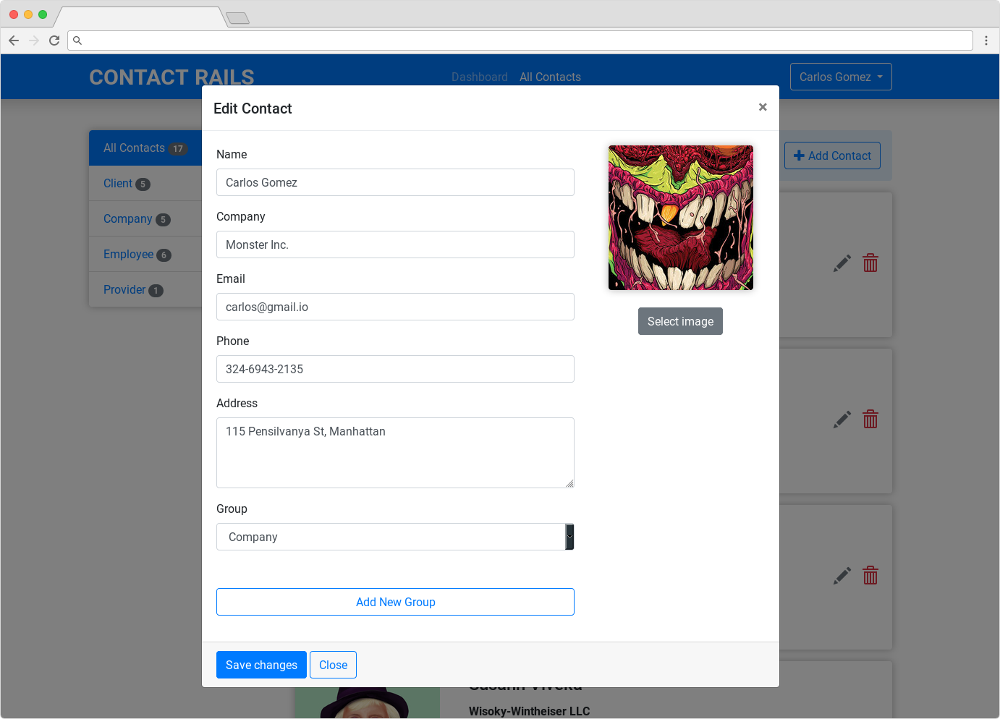
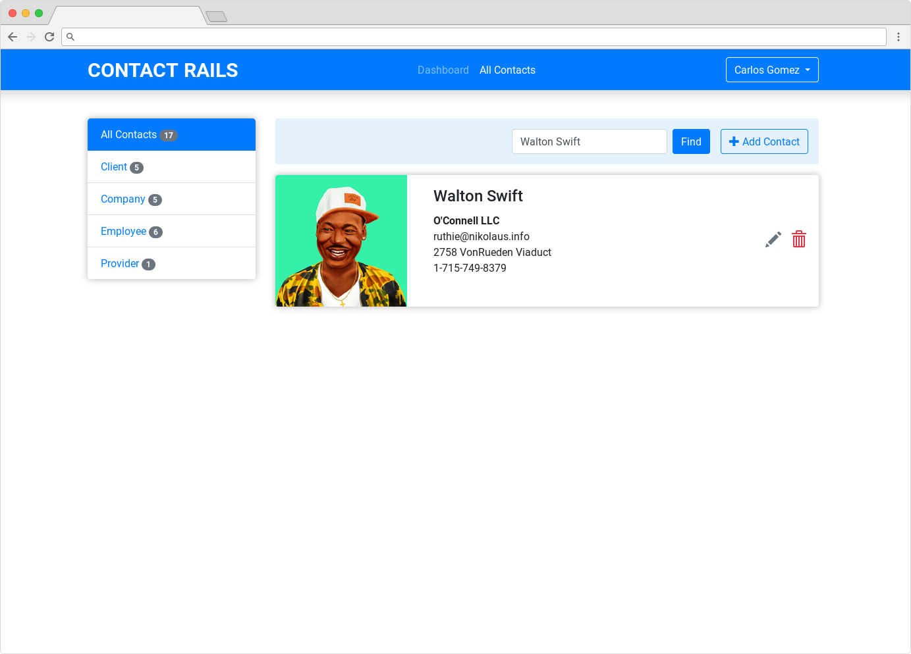

# CONTACT RAILS APP

Beautiful contact manager app has been made on Ruby on Rails and ajax.

## Instructions

1.  Download the app `git clone git@github.com:carlosgomez2/contact_manager.git && cd contact_manager`
2.  run `bundle` to install all dependencies
3.  then run `rails server` and go to **http://localhost:3000/** in your web browser

## Screenshots

